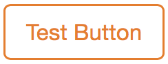
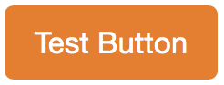

lightstrap-buttons
==================

Simple outline-to-solid CSS buttons




# Install

```
bower install lightstrap-buttons --save
```

# Usage

Example:
```html
<button class="lb-btn lb-carrot">My Button</button>
```

The color classes like `lb-carrot` are the first and third rows of http://flatuicolors.com.
